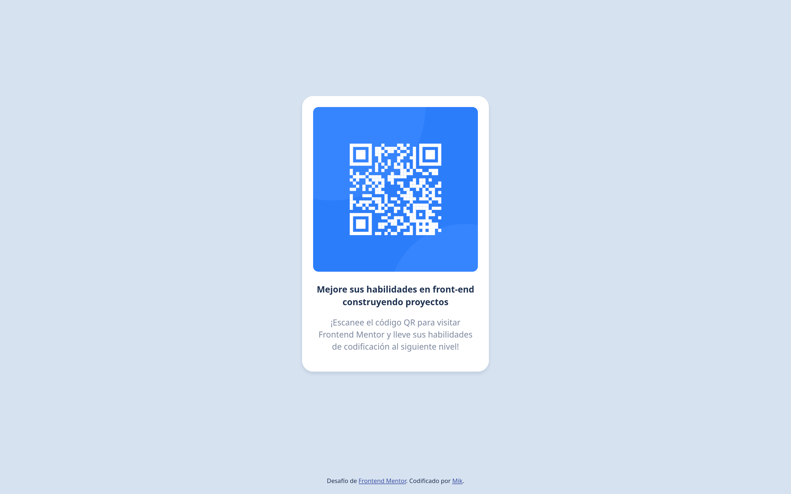
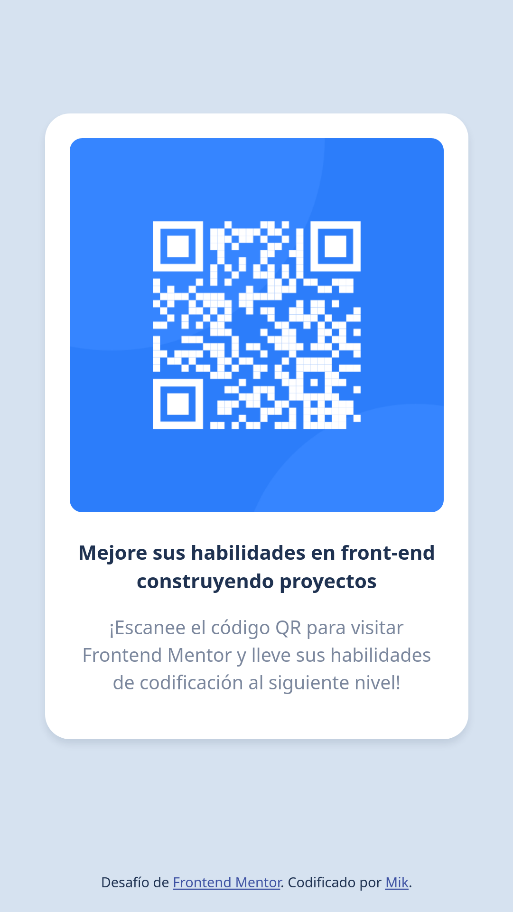

# Frontend Mentor - Componente de código QR

## Table of contents

- [Resumen](#resumen)
  - [Capturas de pantalla](#capturas-de-pantalla)
  - [Enlaces](#enlaces)
- [Mi proceso](#mi-proceso)
  - [Desarrollado con](#desarrollado-con)
  - [Lo que aprendí](#lo-que-aprendí)
  - [Desarrollo continuo](#desarrollo-continuo)
- [Autor](#autor)

## Resumen

Este es el primer desafío de Frontend Mentor, donde hay que replicar una imagen con un código QR. Junto con el desafío vienen recursos como: capturas de ejemplo, favicon, la imagen del QR y una guía de estilo.

### Capturas de pantalla

### Enlaces

- URL de la solución en Github Pages: [Github Pages](https://mikrod-developer.github.io/frontendmentor-qrcode/)
- URL del repositorio en Github: [Repositorio en Github](https://github.com/mikrod-developer/frontendmentor-qrcode)

## Mi proceso

### Desarrollado con

- Etiquetas semánticas de HTML5
- Propiedades custom de CSS y reset ligero
- Flexbox
- Flujo de trabajo Mobile-first

### Lo que aprendí

Aprendí lo que es trabajar con una guía de estilo, y un plan de acción previo a comenzar a codificar. Me resultó muy ligero el tener a la mano el diseño hecho y claro.

Tuve que repasar Flexbox para conseguir la responsividad sin usar media queries.

### Desarrollo continuo

Mi plan es hacer un fork de este proyecto e implementar un generador de QR con enlaces.

## Autor

- Website - [Mikrod](https://github.com/mikrod-developer)
- Frontend Mentor - [@mikrod-developer](https://www.frontendmentor.io/profile/mikrod-developer)
